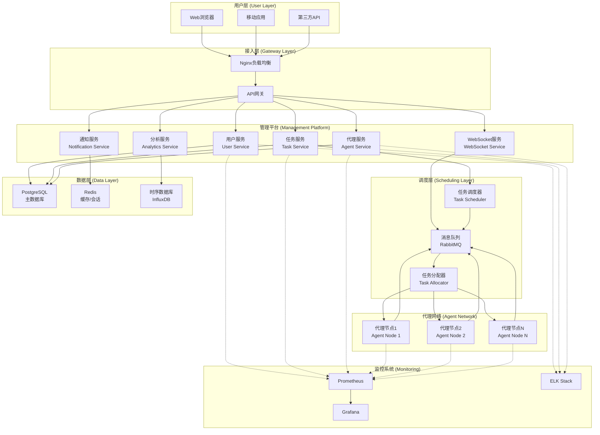
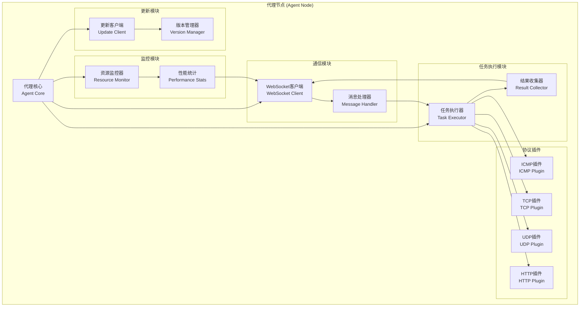
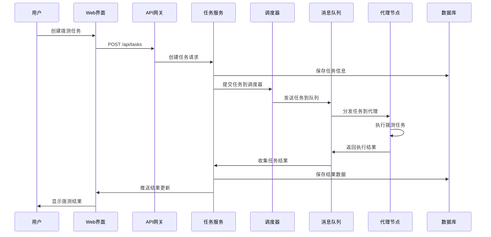
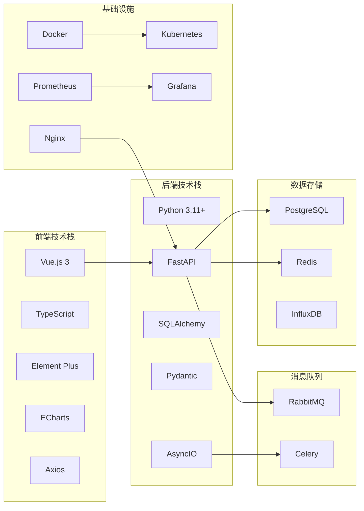
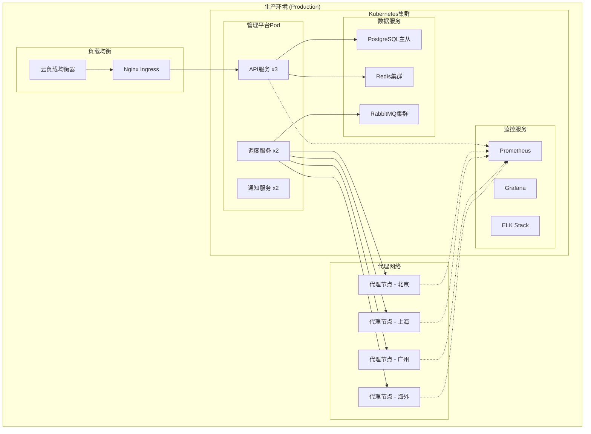
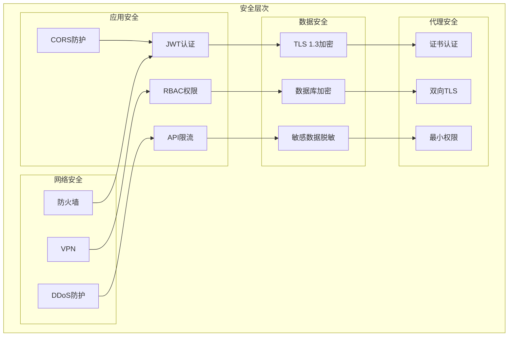

# 网络拨测平台系统架构图

## 整体架构概览

## 代理节点内部架构

## 数据流架构

## 技术栈架构

## 部署架构

## 安全架构

## 关键特性说明

### 1. 分布式架构
- **微服务设计**：各功能模块独立部署和扩展
- **水平扩展**：支持根据负载动态扩容
- **故障隔离**：单个服务故障不影响整体系统

### 2. 高可用性
- **多实例部署**：关键服务多副本运行
- **负载均衡**：请求分发到多个实例
- **故障转移**：自动检测和恢复故障节点

### 3. 安全性
- **端到端加密**：所有通信使用TLS加密
- **身份认证**：JWT + RBAC权限控制
- **代理安全**：证书认证，不对外开放端口

### 4. 可扩展性
- **插件系统**：支持自定义协议插件
- **配置驱动**：通过配置文件灵活调整
- **API版本化**：向后兼容的API设计

### 5. 监控运维
- **全链路监控**：从用户请求到代理执行的完整监控
- **实时告警**：异常情况及时通知
- **日志聚合**：集中收集和分析日志

这个架构设计确保了系统的高性能、高可用性和可扩展性，能够支撑大规模的网络拨测需求。