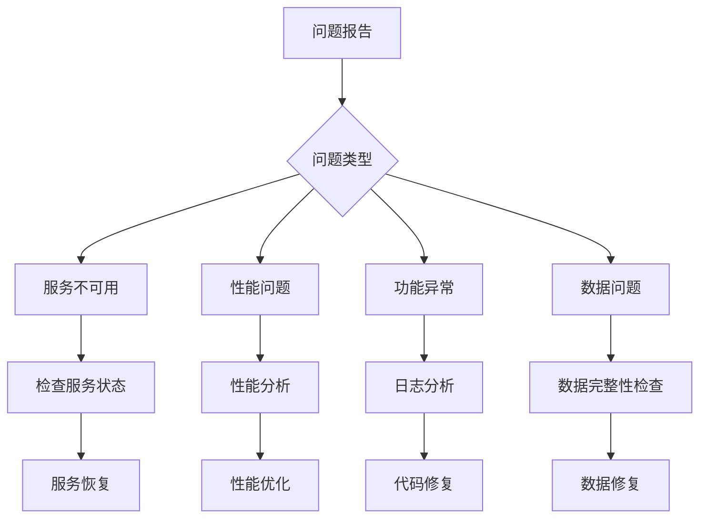

# 故障排除和性能优化指南

## 概述

本文档提供网络拨测平台常见问题的诊断方法、解决方案和性能优化策略。通过系统化的故障排除流程，帮助运维人员快速定位和解决问题。

## 故障排除流程

### 1. 问题分类



### 2. 诊断工具

#### 系统诊断脚本

```bash
#!/bin/bash
# scripts/system-diagnosis.sh

REPORT_FILE="/tmp/system-diagnosis-$(date +%Y%m%d-%H%M%S).txt"

echo "=== Network Probe Platform System Diagnosis ===" > $REPORT_FILE
echo "Generated at: $(date)" >> $REPORT_FILE
echo >> $REPORT_FILE

# 系统信息
echo "=== System Information ===" >> $REPORT_FILE
uname -a >> $REPORT_FILE
cat /etc/os-release >> $REPORT_FILE
echo >> $REPORT_FILE

# 资源使用情况
echo "=== Resource Usage ===" >> $REPORT_FILE
echo "CPU Usage:" >> $REPORT_FILE
top -bn1 | head -20 >> $REPORT_FILE
echo >> $REPORT_FILE

echo "Memory Usage:" >> $REPORT_FILE
free -h >> $REPORT_FILE
echo >> $REPORT_FILE

echo "Disk Usage:" >> $REPORT_FILE
df -h >> $REPORT_FILE
echo >> $REPORT_FILE

echo "Network Connections:" >> $REPORT_FILE
netstat -tuln >> $REPORT_FILE
echo >> $REPORT_FILE

# Docker状态
echo "=== Docker Status ===" >> $REPORT_FILE
docker version >> $REPORT_FILE
echo >> $REPORT_FILE
docker-compose ps >> $REPORT_FILE
echo >> $REPORT_FILE

# 服务日志
echo "=== Service Logs (Last 50 lines) ===" >> $REPORT_FILE
echo "--- Management Service ---" >> $REPORT_FILE
docker logs --tail 50 management >> $REPORT_FILE 2>&1
echo >> $REPORT_FILE

echo "--- PostgreSQL ---" >> $REPORT_FILE
docker logs --tail 50 postgres >> $REPORT_FILE 2>&1
echo >> $REPORT_FILE

echo "--- Redis ---" >> $REPORT_FILE
docker logs --tail 50 redis >> $REPORT_FILE 2>&1
echo >> $REPORT_FILE

# 网络测试
echo "=== Network Tests ===" >> $REPORT_FILE
echo "API Health Check:" >> $REPORT_FILE
curl -s http://localhost:8000/api/v1/health >> $REPORT_FILE 2>&1
echo >> $REPORT_FILE

echo "Database Connection:" >> $REPORT_FILE
docker exec postgres pg_isready -U postgres >> $REPORT_FILE 2>&1
echo >> $REPORT_FILE

echo "Redis Connection:" >> $REPORT_FILE
docker exec redis redis-cli ping >> $REPORT_FILE 2>&1
echo >> $REPORT_FILE

echo "Diagnosis report saved to: $REPORT_FILE"
```

#### 性能分析工具

```python
# scripts/performance-analyzer.py
import psutil
import time
import json
import subprocess
from datetime import datetime
import psycopg2
import redis

class PerformanceAnalyzer:
    def __init__(self):
        self.results = {
            'timestamp': datetime.now().isoformat(),
            'system': {},
            'database': {},
            'redis': {},
            'docker': {},
            'recommendations': []
        }
    
    def analyze_system_performance(self):
        """分析系统性能"""
        # CPU分析
        cpu_percent = psutil.cpu_percent(interval=1)
        cpu_count = psutil.cpu_count()
        load_avg = psutil.getloadavg()
        
        # 内存分析
        memory = psutil.virtual_memory()
        swap = psutil.swap_memory()
        
        # 磁盘分析
        disk = psutil.disk_usage('/')
        disk_io = psutil.disk_io_counters()
        
        # 网络分析
        network_io = psutil.net_io_counters()
        
        self.results['system'] = {
            'cpu': {
                'usage_percent': cpu_percent,
                'count': cpu_count,
                'load_average': load_avg
            },
            'memory': {
                'total': memory.total,
                'available': memory.available,
                'percent': memory.percent,
                'swap_percent': swap.percent
            },
            'disk': {
                'total': disk.total,
                'used': disk.used,
                'free': disk.free,
                'percent': (disk.used / disk.total) * 100,
                'io_read_bytes': disk_io.read_bytes if disk_io else 0,
                'io_write_bytes': disk_io.write_bytes if disk_io else 0
            },
            'network': {
                'bytes_sent': network_io.bytes_sent,
                'bytes_recv': network_io.bytes_recv,
                'packets_sent': network_io.packets_sent,
                'packets_recv': network_io.packets_recv
            }
        }
        
        # 生成系统建议
        if cpu_percent > 80:
            self.results['recommendations'].append({
                'type': 'cpu',
                'severity': 'high',
                'message': f'High CPU usage: {cpu_percent}%'
            })
        
        if memory.percent > 85:
            self.results['recommendations'].append({
                'type': 'memory',
                'severity': 'high',
                'message': f'High memory usage: {memory.percent}%'
            })
        
        if (disk.used / disk.total) * 100 > 80:
            self.results['recommendations'].append({
                'type': 'disk',
                'severity': 'medium',
                'message': f'High disk usage: {(disk.used / disk.total) * 100:.1f}%'
            })
    
    def analyze_database_performance(self):
        """分析数据库性能"""
        try:
            conn = psycopg2.connect(
                host="localhost",
                port=5432,
                database="network_probe",
                user="postgres",
                password="password"
            )
            cursor = conn.cursor()
            
            # 连接数统计
            cursor.execute("""
                SELECT state, count(*) 
                FROM pg_stat_activity 
                GROUP BY state;
            """)
            connections = dict(cursor.fetchall())
            
            # 数据库大小
            cursor.execute("""
                SELECT pg_size_pretty(pg_database_size('network_probe'));
            """)
            db_size = cursor.fetchone()[0]
            
            # 慢查询统计
            cursor.execute("""
                SELECT count(*) 
                FROM pg_stat_statements 
                WHERE mean_time > 1000;
            """)
            slow_queries = cursor.fetchone()[0]
            
            # 锁等待
            cursor.execute("""
                SELECT count(*) 
                FROM pg_locks 
                WHERE NOT granted;
            """)
            waiting_locks = cursor.fetchone()[0]
            
            # 缓存命中率
            cursor.execute("""
                SELECT 
                    sum(heap_blks_hit) / (sum(heap_blks_hit) + sum(heap_blks_read)) * 100 as hit_ratio
                FROM pg_statio_user_tables;
            """)
            cache_hit_ratio = cursor.fetchone()[0] or 0
            
            self.results['database'] = {
                'connections': connections,
                'size': db_size,
                'slow_queries': slow_queries,
                'waiting_locks': waiting_locks,
                'cache_hit_ratio': float(cache_hit_ratio)
            }
            
            # 数据库建议
            if slow_queries > 10:
                self.results['recommendations'].append({
                    'type': 'database',
                    'severity': 'medium',
                    'message': f'Found {slow_queries} slow queries'
                })
            
            if cache_hit_ratio < 95:
                self.results['recommendations'].append({
                    'type': 'database',
                    'severity': 'medium',
                    'message': f'Low cache hit ratio: {cache_hit_ratio:.1f}%'
                })
            
            conn.close()
            
        except Exception as e:
            self.results['database'] = {'error': str(e)}
    
    def analyze_redis_performance(self):
        """分析Redis性能"""
        try:
            r = redis.Redis(host='localhost', port=6379, password='password')
            info = r.info()
            
            self.results['redis'] = {
                'connected_clients': info.get('connected_clients', 0),
                'used_memory': info.get('used_memory', 0),
                'used_memory_human': info.get('used_memory_human', '0B'),
                'keyspace_hits': info.get('keyspace_hits', 0),
                'keyspace_misses': info.get('keyspace_misses', 0),
                'ops_per_sec': info.get('instantaneous_ops_per_sec', 0)
            }
            
            # Redis建议
            hit_rate = 0
            if info.get('keyspace_hits', 0) + info.get('keyspace_misses', 0) > 0:
                hit_rate = info['keyspace_hits'] / (info['keyspace_hits'] + info['keyspace_misses']) * 100
            
            if hit_rate < 90:
                self.results['recommendations'].append({
                    'type': 'redis',
                    'severity': 'medium',
                    'message': f'Low Redis hit rate: {hit_rate:.1f}%'
                })
            
        except Exception as e:
            self.results['redis'] = {'error': str(e)}
    
    def analyze_docker_performance(self):
        """分析Docker容器性能"""
        try:
            # 获取容器统计信息
            result = subprocess.run(['docker', 'stats', '--no-stream', '--format', 
                                   'table {{.Container}}\t{{.CPUPerc}}\t{{.MemUsage}}\t{{.NetIO}}\t{{.BlockIO}}'],
                                  capture_output=True, text=True)
            
            if result.returncode == 0:
                lines = result.stdout.strip().split('\n')[1:]  # 跳过标题行
                containers = []
                
                for line in lines:
                    parts = line.split('\t')
                    if len(parts) >= 5:
                        containers.append({
                            'name': parts[0],
                            'cpu_percent': parts[1],
                            'memory_usage': parts[2],
                            'network_io': parts[3],
                            'block_io': parts[4]
                        })
                
                self.results['docker'] = {'containers': containers}
            
        except Exception as e:
            self.results['docker'] = {'error': str(e)}
    
    def generate_report(self):
        """生成性能分析报告"""
        self.analyze_system_performance()
        self.analyze_database_performance()
        self.analyze_redis_performance()
        self.analyze_docker_performance()
        
        # 保存报告
        report_file = f"/tmp/performance-report-{datetime.now().strftime('%Y%m%d-%H%M%S')}.json"
        with open(report_file, 'w') as f:
            json.dump(self.results, f, indent=2, default=str)
        
        print(f"Performance report saved to: {report_file}")
        return self.results

if __name__ == "__main__":
    analyzer = PerformanceAnalyzer()
    report = analyzer.generate_report()
    
    # 打印摘要
    print("\n=== Performance Summary ===")
    print(f"CPU Usage: {report['system']['cpu']['usage_percent']}%")
    print(f"Memory Usage: {report['system']['memory']['percent']}%")
    print(f"Disk Usage: {report['system']['disk']['percent']:.1f}%")
    
    if report['recommendations']:
        print("\n=== Recommendations ===")
        for rec in report['recommendations']:
            print(f"[{rec['severity'].upper()}] {rec['type']}: {rec['message']}")
```

## 常见问题解决方案

### 1. 服务启动问题

#### 管理平台无法启动

**症状**：
- 容器启动失败
- API接口无响应
- 日志显示连接错误

**诊断步骤**：

```bash
# 1. 检查容器状态
docker-compose ps

# 2. 查看启动日志
docker-compose logs management

# 3. 检查端口占用
netstat -tlnp | grep 8000

# 4. 检查配置文件
cat deployment/.env | grep -v "^#"
```

**解决方案**：

```bash
# 解决方案1: 重启服务
docker-compose restart management

# 解决方案2: 检查数据库连接
docker exec management python -c "
from management_platform.database.connection import test_connection
test_connection()
"

# 解决方案3: 重建容器
docker-compose down
docker-compose up -d

# 解决方案4: 检查环境变量
docker exec management env | grep DATABASE_URL
```

#### 数据库连接失败

**症状**：
- 应用无法连接数据库
- 连接超时错误
- 认证失败

**诊断步骤**：

```bash
# 1. 检查PostgreSQL状态
docker exec postgres pg_isready -U postgres

# 2. 测试连接
docker exec postgres psql -U postgres -d network_probe -c "SELECT 1;"

# 3. 检查连接数
docker exec postgres psql -U postgres -c "
SELECT count(*) as connections, state 
FROM pg_stat_activity 
GROUP BY state;
"

# 4. 检查日志
docker logs postgres | tail -50
```

**解决方案**：

```bash
# 解决方案1: 重启数据库
docker-compose restart postgres

# 解决方案2: 检查连接池配置
# 编辑 deployment/.env
MAX_CONNECTIONS=200
DB_POOL_SIZE=20

# 解决方案3: 清理连接
docker exec postgres psql -U postgres -c "
SELECT pg_terminate_backend(pid) 
FROM pg_stat_activity 
WHERE state = 'idle' AND state_change < now() - interval '1 hour';
"

# 解决方案4: 重建数据库容器
docker-compose stop postgres
docker volume rm network-probe_postgres_data  # 注意：会丢失数据
docker-compose up -d postgres
```

### 2. 性能问题

#### 响应时间过长

**症状**：
- API响应时间超过5秒
- 页面加载缓慢
- 超时错误

**诊断步骤**：

```bash
# 1. 检查系统负载
top
htop
iostat -x 1

# 2. 分析慢查询
docker exec postgres psql -U postgres -d network_probe -c "
SELECT query, calls, total_time, mean_time, rows
FROM pg_stat_statements 
WHERE mean_time > 1000
ORDER BY total_time DESC 
LIMIT 10;
"

# 3. 检查锁等待
docker exec postgres psql -U postgres -d network_probe -c "
SELECT blocked_locks.pid AS blocked_pid,
       blocked_activity.usename AS blocked_user,
       blocking_locks.pid AS blocking_pid,
       blocking_activity.usename AS blocking_user,
       blocked_activity.query AS blocked_statement
FROM pg_catalog.pg_locks blocked_locks
JOIN pg_catalog.pg_stat_activity blocked_activity ON blocked_activity.pid = blocked_locks.pid
JOIN pg_catalog.pg_locks blocking_locks ON blocking_locks.locktype = blocked_locks.locktype
JOIN pg_catalog.pg_stat_activity blocking_activity ON blocking_activity.pid = blocking_locks.pid
WHERE NOT blocked_locks.GRANTED;
"
```

**解决方案**：

```bash
# 解决方案1: 优化数据库
docker exec postgres psql -U postgres -d network_probe -c "
VACUUM ANALYZE;
REINDEX DATABASE network_probe;
"

# 解决方案2: 增加连接池大小
# 编辑应用配置
DB_POOL_SIZE=50
DB_MAX_OVERFLOW=100

# 解决方案3: 添加索引
docker exec postgres psql -U postgres -d network_probe -c "
CREATE INDEX CONCURRENTLY idx_task_results_execution_time 
ON task_results(execution_time);

CREATE INDEX CONCURRENTLY idx_tasks_user_id_status 
ON tasks(user_id, status);
"

# 解决方案4: 启用查询缓存
# 在Redis中缓存频繁查询的结果
```

#### 内存使用过高

**症状**：
- 系统内存使用率超过90%
- 应用出现OOM错误
- 系统响应缓慢

**诊断步骤**：

```bash
# 1. 检查内存使用
free -h
ps aux --sort=-%mem | head -20

# 2. 检查容器内存使用
docker stats --no-stream

# 3. 分析内存泄漏
# 使用内存分析工具
python -m memory_profiler management_platform/api/main.py
```

**解决方案**：

```bash
# 解决方案1: 限制容器内存
# 在docker-compose.yml中添加
services:
  management:
    mem_limit: 2g
    memswap_limit: 2g

# 解决方案2: 优化应用配置
# 减少连接池大小
DB_POOL_SIZE=10
REDIS_POOL_SIZE=20

# 解决方案3: 清理缓存
docker exec redis redis-cli FLUSHDB

# 解决方案4: 重启服务
docker-compose restart
```

### 3. 网络问题

#### WebSocket连接失败

**症状**：
- 代理无法连接到管理平台
- 连接频繁断开
- 认证失败

**诊断步骤**：

```bash
# 1. 测试WebSocket连接
wscat -c ws://localhost:8000/ws

# 2. 检查SSL证书
openssl s_client -connect your-domain.com:443 -servername your-domain.com

# 3. 检查防火墙
iptables -L
ufw status

# 4. 检查代理日志
sudo journalctl -u network-probe-agent -f
```

**解决方案**：

```bash
# 解决方案1: 检查证书配置
# 更新SSL证书
certbot renew

# 解决方案2: 配置防火墙
ufw allow 443/tcp
ufw allow 8000/tcp

# 解决方案3: 重启代理服务
sudo systemctl restart network-probe-agent

# 解决方案4: 检查代理配置
vim /etc/network-probe/config.yaml
```

### 4. 数据问题

#### 数据不一致

**症状**：
- 任务结果丢失
- 统计数据错误
- 重复数据

**诊断步骤**：

```bash
# 1. 检查数据完整性
docker exec postgres psql -U postgres -d network_probe -c "
SELECT 
    t.id as task_id,
    t.name,
    count(tr.id) as result_count,
    max(tr.execution_time) as last_execution
FROM tasks t
LEFT JOIN task_results tr ON t.id = tr.task_id
WHERE t.status = 'active'
GROUP BY t.id, t.name
HAVING count(tr.id) = 0 OR max(tr.execution_time) < now() - interval '1 hour';
"

# 2. 检查重复数据
docker exec postgres psql -U postgres -d network_probe -c "
SELECT task_id, execution_time, count(*)
FROM task_results
GROUP BY task_id, execution_time
HAVING count(*) > 1;
"
```

**解决方案**：

```bash
# 解决方案1: 清理重复数据
docker exec postgres psql -U postgres -d network_probe -c "
DELETE FROM task_results a USING task_results b
WHERE a.id < b.id 
AND a.task_id = b.task_id 
AND a.execution_time = b.execution_time;
"

# 解决方案2: 重建索引
docker exec postgres psql -U postgres -d network_probe -c "
REINDEX TABLE task_results;
"

# 解决方案3: 数据修复脚本
python scripts/data-repair.py
```

## 性能优化

### 1. 数据库优化

#### PostgreSQL配置优化

```sql
-- postgresql.conf 优化配置
-- 内存配置
shared_buffers = 256MB                    -- 25% of RAM
effective_cache_size = 1GB                -- 75% of RAM
work_mem = 4MB                           -- Per connection
maintenance_work_mem = 64MB              -- For maintenance operations

-- 连接配置
max_connections = 200                     -- Maximum connections
shared_preload_libraries = 'pg_stat_statements'

-- 检查点配置
checkpoint_completion_target = 0.9
wal_buffers = 16MB
checkpoint_timeout = 10min

-- 查询优化
random_page_cost = 1.1                   -- For SSD
effective_io_concurrency = 200           -- For SSD
default_statistics_target = 100

-- 日志配置
log_min_duration_statement = 1000        -- Log slow queries
log_checkpoints = on
log_connections = on
log_disconnections = on
log_lock_waits = on
```

#### 索引优化

```sql
-- 创建性能优化索引
CREATE INDEX CONCURRENTLY idx_task_results_task_id_time 
ON task_results(task_id, execution_time DESC);

CREATE INDEX CONCURRENTLY idx_task_results_execution_time 
ON task_results(execution_time) 
WHERE execution_time >= CURRENT_DATE - INTERVAL '30 days';

CREATE INDEX CONCURRENTLY idx_tasks_user_status 
ON tasks(user_id, status) 
WHERE status IN ('active', 'paused');

CREATE INDEX CONCURRENTLY idx_agents_status_location 
ON agents(status, location) 
WHERE status = 'online';

-- 部分索引优化存储
CREATE INDEX CONCURRENTLY idx_task_results_failed 
ON task_results(task_id, execution_time) 
WHERE status = 'error';

-- 表达式索引
CREATE INDEX CONCURRENTLY idx_task_results_date 
ON task_results(DATE(execution_time));
```

#### 查询优化

```sql
-- 优化前的查询
SELECT t.*, tr.* 
FROM tasks t 
LEFT JOIN task_results tr ON t.id = tr.task_id 
WHERE t.user_id = 'user123' 
ORDER BY tr.execution_time DESC;

-- 优化后的查询
SELECT t.id, t.name, t.status,
       (SELECT json_agg(
           json_build_object(
               'execution_time', execution_time,
               'status', status,
               'duration', duration
           ) ORDER BY execution_time DESC
       ) FROM task_results 
        WHERE task_id = t.id 
        AND execution_time >= CURRENT_DATE - INTERVAL '7 days'
        LIMIT 100
       ) as recent_results
FROM tasks t 
WHERE t.user_id = 'user123' 
AND t.status IN ('active', 'paused')
ORDER BY t.created_at DESC;

-- 使用窗口函数优化统计查询
WITH task_stats AS (
    SELECT 
        task_id,
        COUNT(*) as total_executions,
        COUNT(*) FILTER (WHERE status = 'success') as successful_executions,
        AVG(duration) as avg_duration,
        ROW_NUMBER() OVER (PARTITION BY task_id ORDER BY execution_time DESC) as rn
    FROM task_results 
    WHERE execution_time >= CURRENT_DATE - INTERVAL '24 hours'
    GROUP BY task_id
)
SELECT 
    t.id,
    t.name,
    ts.total_executions,
    ts.successful_executions,
    ROUND((ts.successful_executions::float / ts.total_executions * 100), 2) as success_rate,
    ROUND(ts.avg_duration, 2) as avg_duration
FROM tasks t
JOIN task_stats ts ON t.id = ts.task_id
WHERE t.user_id = 'user123';
```

### 2. 应用层优化

#### 连接池优化

```python
# management_platform/database/connection.py
from sqlalchemy import create_engine
from sqlalchemy.pool import QueuePool
import os

# 优化的数据库连接配置
engine = create_engine(
    os.getenv('DATABASE_URL'),
    poolclass=QueuePool,
    pool_size=20,                    # 基础连接数
    max_overflow=50,                 # 最大溢出连接数
    pool_pre_ping=True,              # 连接前测试
    pool_recycle=3600,               # 连接回收时间(秒)
    pool_timeout=30,                 # 获取连接超时时间
    echo=False,                      # 生产环境关闭SQL日志
    connect_args={
        "options": "-c timezone=utc",
        "application_name": "network_probe_management",
        "connect_timeout": 10
    }
)

# Redis连接池优化
import redis
from redis.connection import ConnectionPool

redis_pool = ConnectionPool(
    host=os.getenv('REDIS_HOST', 'redis'),
    port=int(os.getenv('REDIS_PORT', 6379)),
    password=os.getenv('REDIS_PASSWORD'),
    db=0,
    max_connections=100,             # 最大连接数
    socket_keepalive=True,           # 启用TCP keepalive
    socket_keepalive_options={
        1: 1,    # TCP_KEEPIDLE
        2: 3,    # TCP_KEEPINTVL  
        3: 5     # TCP_KEEPCNT
    },
    socket_connect_timeout=5,        # 连接超时
    socket_timeout=5,                # 读写超时
    retry_on_timeout=True,
    health_check_interval=30         # 健康检查间隔
)

redis_client = redis.Redis(connection_pool=redis_pool)
```

#### 缓存优化

```python
# management_platform/cache/manager.py
import json
import hashlib
from functools import wraps
from typing import Any, Optional
import redis

class CacheManager:
    def __init__(self, redis_client: redis.Redis):
        self.redis = redis_client
        self.default_ttl = 300  # 5分钟默认过期时间
    
    def cache_key(self, prefix: str, *args, **kwargs) -> str:
        """生成缓存键"""
        key_data = f"{prefix}:{args}:{sorted(kwargs.items())}"
        return f"cache:{hashlib.md5(key_data.encode()).hexdigest()}"
    
    def get(self, key: str) -> Optional[Any]:
        """获取缓存"""
        try:
            data = self.redis.get(key)
            return json.loads(data) if data else None
        except Exception:
            return None
    
    def set(self, key: str, value: Any, ttl: int = None) -> bool:
        """设置缓存"""
        try:
            ttl = ttl or self.default_ttl
            return self.redis.setex(key, ttl, json.dumps(value, default=str))
        except Exception:
            return False
    
    def delete(self, key: str) -> bool:
        """删除缓存"""
        try:
            return bool(self.redis.delete(key))
        except Exception:
            return False
    
    def cache_result(self, prefix: str, ttl: int = None):
        """缓存装饰器"""
        def decorator(func):
            @wraps(func)
            async def wrapper(*args, **kwargs):
                # 生成缓存键
                cache_key = self.cache_key(prefix, *args, **kwargs)
                
                # 尝试从缓存获取
                cached_result = self.get(cache_key)
                if cached_result is not None:
                    return cached_result
                
                # 执行函数并缓存结果
                result = await func(*args, **kwargs)
                self.set(cache_key, result, ttl)
                
                return result
            return wrapper
        return decorator

# 使用示例
cache_manager = CacheManager(redis_client)

@cache_manager.cache_result("task_results", ttl=600)
async def get_task_results(task_id: str, start_time: str, end_time: str):
    # 数据库查询逻辑
    pass

@cache_manager.cache_result("user_stats", ttl=300)
async def get_user_statistics(user_id: str):
    # 统计查询逻辑
    pass
```

#### 异步处理优化

```python
# management_platform/async/processor.py
import asyncio
import aioredis
from concurrent.futures import ThreadPoolExecutor
from typing import List, Callable, Any

class AsyncProcessor:
    def __init__(self, max_workers: int = 10):
        self.executor = ThreadPoolExecutor(max_workers=max_workers)
        self.semaphore = asyncio.Semaphore(max_workers)
    
    async def process_batch(self, items: List[Any], processor: Callable, batch_size: int = 100):
        """批量异步处理"""
        results = []
        
        for i in range(0, len(items), batch_size):
            batch = items[i:i + batch_size]
            batch_tasks = []
            
            for item in batch:
                async with self.semaphore:
                    task = asyncio.create_task(processor(item))
                    batch_tasks.append(task)
            
            batch_results = await asyncio.gather(*batch_tasks, return_exceptions=True)
            results.extend(batch_results)
        
        return results
    
    async def run_in_executor(self, func: Callable, *args):
        """在线程池中执行同步函数"""
        loop = asyncio.get_event_loop()
        return await loop.run_in_executor(self.executor, func, *args)

# 使用示例
processor = AsyncProcessor(max_workers=20)

async def process_task_results(task_results: List[dict]):
    """批量处理任务结果"""
    
    async def save_result(result: dict):
        # 异步保存单个结果
        async with get_db_session() as session:
            await session.execute(insert_query, result)
            await session.commit()
    
    # 批量异步处理
    await processor.process_batch(task_results, save_result, batch_size=50)
```

### 3. 系统级优化

#### 操作系统优化

```bash
#!/bin/bash
# scripts/system-optimization.sh

echo "Optimizing system for Network Probe Platform..."

# 1. 内核参数优化
cat >> /etc/sysctl.conf << EOF
# 网络优化
net.core.rmem_max = 16777216
net.core.wmem_max = 16777216
net.ipv4.tcp_rmem = 4096 87380 16777216
net.ipv4.tcp_wmem = 4096 65536 16777216
net.core.netdev_max_backlog = 5000
net.ipv4.tcp_congestion_control = bbr

# 文件描述符限制
fs.file-max = 1000000
fs.nr_open = 1000000

# 内存管理
vm.swappiness = 10
vm.dirty_ratio = 15
vm.dirty_background_ratio = 5

# 进程限制
kernel.pid_max = 4194304
EOF

# 应用内核参数
sysctl -p

# 2. 用户限制优化
cat >> /etc/security/limits.conf << EOF
* soft nofile 65536
* hard nofile 65536
* soft nproc 65536
* hard nproc 65536
network-probe soft nofile 100000
network-probe hard nofile 100000
EOF

# 3. 服务优化
# 优化systemd服务配置
mkdir -p /etc/systemd/system/network-probe-agent.service.d
cat > /etc/systemd/system/network-probe-agent.service.d/override.conf << EOF
[Service]
LimitNOFILE=100000
LimitNPROC=100000
OOMScoreAdjust=-500
EOF

systemctl daemon-reload

echo "System optimization completed"
```

#### Docker优化

```yaml
# docker-compose.prod.yml - 生产环境优化配置
version: '3.8'

services:
  management:
    deploy:
      resources:
        limits:
          cpus: '2.0'
          memory: 4G
        reservations:
          cpus: '1.0'
          memory: 2G
    environment:
      - PYTHONUNBUFFERED=1
      - PYTHONDONTWRITEBYTECODE=1
    ulimits:
      nofile:
        soft: 65536
        hard: 65536
    logging:
      driver: "json-file"
      options:
        max-size: "100m"
        max-file: "5"

  postgres:
    deploy:
      resources:
        limits:
          cpus: '2.0'
          memory: 4G
        reservations:
          cpus: '1.0'
          memory: 2G
    command: >
      postgres
      -c max_connections=200
      -c shared_buffers=256MB
      -c effective_cache_size=1GB
      -c work_mem=4MB
      -c maintenance_work_mem=64MB
      -c checkpoint_completion_target=0.9
      -c wal_buffers=16MB
      -c default_statistics_target=100
      -c random_page_cost=1.1
      -c effective_io_concurrency=200
    shm_size: 256mb

  redis:
    deploy:
      resources:
        limits:
          cpus: '1.0'
          memory: 1G
        reservations:
          cpus: '0.5'
          memory: 512M
    command: >
      redis-server
      --maxmemory 512mb
      --maxmemory-policy allkeys-lru
      --save 900 1
      --save 300 10
      --save 60 10000
      --tcp-keepalive 300
```

### 4. 监控和调优

#### 性能监控脚本

```bash
#!/bin/bash
# scripts/performance-monitor.sh

REPORT_FILE="/var/log/network-probe/performance-$(date +%Y%m%d-%H%M%S).log"

echo "=== Performance Monitoring Report ===" > $REPORT_FILE
echo "Timestamp: $(date)" >> $REPORT_FILE
echo >> $REPORT_FILE

# 系统负载
echo "=== System Load ===" >> $REPORT_FILE
uptime >> $REPORT_FILE
echo >> $REPORT_FILE

# CPU使用率
echo "=== CPU Usage ===" >> $REPORT_FILE
top -bn1 | grep "Cpu(s)" >> $REPORT_FILE
echo >> $REPORT_FILE

# 内存使用
echo "=== Memory Usage ===" >> $REPORT_FILE
free -h >> $REPORT_FILE
echo >> $REPORT_FILE

# 磁盘IO
echo "=== Disk I/O ===" >> $REPORT_FILE
iostat -x 1 3 >> $REPORT_FILE
echo >> $REPORT_FILE

# 网络统计
echo "=== Network Statistics ===" >> $REPORT_FILE
ss -tuln >> $REPORT_FILE
echo >> $REPORT_FILE

# 数据库性能
echo "=== Database Performance ===" >> $REPORT_FILE
docker exec postgres psql -U postgres -d network_probe -c "
SELECT 
    schemaname,
    tablename,
    n_tup_ins as inserts,
    n_tup_upd as updates,
    n_tup_del as deletes,
    n_tup_hot_upd as hot_updates,
    seq_scan,
    seq_tup_read,
    idx_scan,
    idx_tup_fetch
FROM pg_stat_user_tables
ORDER BY n_tup_ins + n_tup_upd + n_tup_del DESC
LIMIT 10;
" >> $REPORT_FILE 2>&1

echo >> $REPORT_FILE

# Redis性能
echo "=== Redis Performance ===" >> $REPORT_FILE
docker exec redis redis-cli info stats | grep -E "(keyspace_hits|keyspace_misses|instantaneous_ops_per_sec)" >> $REPORT_FILE
echo >> $REPORT_FILE

echo "Performance report saved to: $REPORT_FILE"
```

#### 自动调优脚本

```python
# scripts/auto-tuning.py
import psutil
import subprocess
import json
from datetime import datetime

class AutoTuner:
    def __init__(self):
        self.recommendations = []
    
    def analyze_system(self):
        """分析系统性能并生成调优建议"""
        
        # CPU分析
        cpu_percent = psutil.cpu_percent(interval=5)
        if cpu_percent > 80:
            self.recommendations.append({
                'component': 'system',
                'issue': 'high_cpu',
                'current_value': cpu_percent,
                'recommendation': 'Consider scaling horizontally or optimizing CPU-intensive operations'
            })
        
        # 内存分析
        memory = psutil.virtual_memory()
        if memory.percent > 85:
            self.recommendations.append({
                'component': 'system',
                'issue': 'high_memory',
                'current_value': memory.percent,
                'recommendation': 'Increase memory or optimize memory usage'
            })
        
        # 磁盘分析
        disk = psutil.disk_usage('/')
        disk_percent = (disk.used / disk.total) * 100
        if disk_percent > 80:
            self.recommendations.append({
                'component': 'system',
                'issue': 'high_disk',
                'current_value': disk_percent,
                'recommendation': 'Clean up old data or expand storage'
            })
    
    def analyze_database(self):
        """分析数据库性能"""
        try:
            # 检查慢查询
            result = subprocess.run([
                'docker', 'exec', 'postgres', 'psql', '-U', 'postgres', 
                '-d', 'network_probe', '-t', '-c',
                "SELECT count(*) FROM pg_stat_statements WHERE mean_time > 1000;"
            ], capture_output=True, text=True)
            
            slow_queries = int(result.stdout.strip())
            if slow_queries > 10:
                self.recommendations.append({
                    'component': 'database',
                    'issue': 'slow_queries',
                    'current_value': slow_queries,
                    'recommendation': 'Optimize slow queries or add indexes'
                })
            
            # 检查缓存命中率
            result = subprocess.run([
                'docker', 'exec', 'postgres', 'psql', '-U', 'postgres',
                '-d', 'network_probe', '-t', '-c',
                """SELECT round(sum(heap_blks_hit) / (sum(heap_blks_hit) + sum(heap_blks_read)) * 100, 2) 
                   FROM pg_statio_user_tables;"""
            ], capture_output=True, text=True)
            
            hit_ratio = float(result.stdout.strip() or 0)
            if hit_ratio < 95:
                self.recommendations.append({
                    'component': 'database',
                    'issue': 'low_cache_hit_ratio',
                    'current_value': hit_ratio,
                    'recommendation': 'Increase shared_buffers or optimize queries'
                })
                
        except Exception as e:
            print(f"Database analysis failed: {e}")
    
    def apply_optimizations(self):
        """应用自动优化"""
        for rec in self.recommendations:
            if rec['component'] == 'database' and rec['issue'] == 'slow_queries':
                # 自动运行VACUUM ANALYZE
                subprocess.run([
                    'docker', 'exec', 'postgres', 'psql', '-U', 'postgres',
                    '-d', 'network_probe', '-c', 'VACUUM ANALYZE;'
                ])
                print("Applied: VACUUM ANALYZE")
            
            elif rec['component'] == 'system' and rec['issue'] == 'high_disk':
                # 清理旧日志
                subprocess.run([
                    'find', '/var/log/network-probe', '-name', '*.log',
                    '-mtime', '+7', '-delete'
                ])
                print("Applied: Log cleanup")
    
    def generate_report(self):
        """生成调优报告"""
        self.analyze_system()
        self.analyze_database()
        
        report = {
            'timestamp': datetime.now().isoformat(),
            'recommendations': self.recommendations
        }
        
        report_file = f"/tmp/auto-tuning-{datetime.now().strftime('%Y%m%d-%H%M%S')}.json"
        with open(report_file, 'w') as f:
            json.dump(report, f, indent=2)
        
        print(f"Auto-tuning report saved to: {report_file}")
        
        # 应用安全的自动优化
        self.apply_optimizations()
        
        return report

if __name__ == "__main__":
    tuner = AutoTuner()
    report = tuner.generate_report()
    
    print("\n=== Auto-Tuning Summary ===")
    for rec in report['recommendations']:
        print(f"[{rec['component'].upper()}] {rec['issue']}: {rec['recommendation']}")
```

这个故障排除和性能优化指南提供了完整的问题诊断和解决方案，帮助运维团队快速定位问题并优化系统性能。