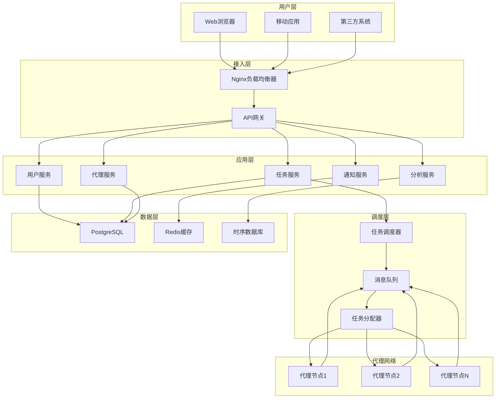
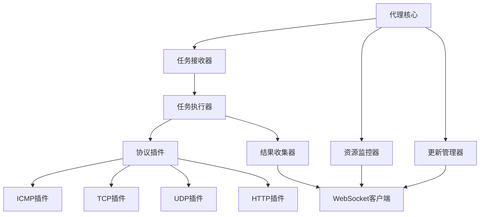
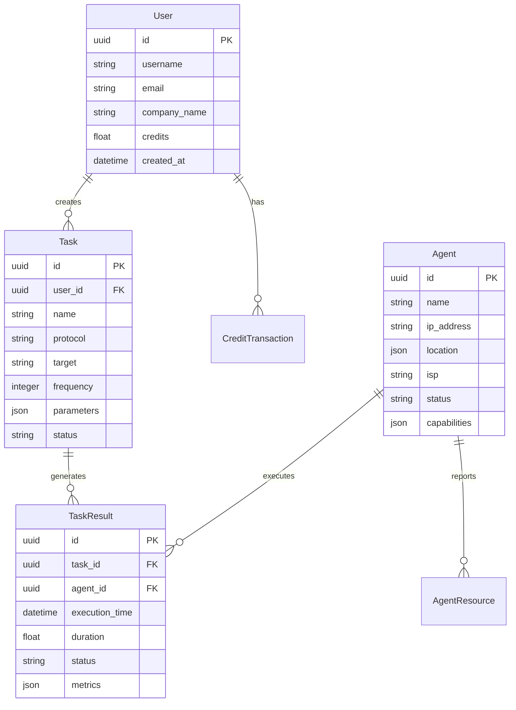
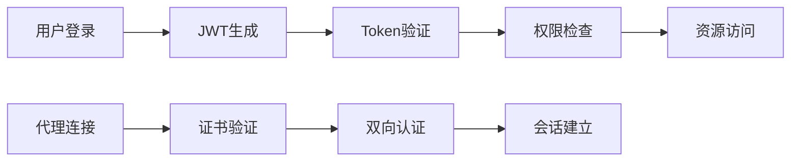

# 系统架构文档

## 概述

网络拨测平台是一个基于Python的分布式系统，采用微服务架构设计，支持高可用、高扩展性的网络监控服务。本文档详细描述了系统的整体架构、核心组件、数据流和技术选型。

## 整体架构

### 系统架构图



### 架构特点

1. **微服务架构**：各功能模块独立部署，便于维护和扩展
2. **分布式设计**：支持水平扩展，提高系统处理能力
3. **异步通信**：使用消息队列实现组件间解耦
4. **容器化部署**：支持Docker和Kubernetes部署
5. **高可用设计**：关键组件支持多实例部署

## 核心组件

### 1. 管理平台 (Management Platform)

#### 1.1 API网关
- **技术栈**：FastAPI + Uvicorn
- **功能**：
  - 统一API入口
  - 请求路由和负载均衡
  - 认证和授权
  - 限流和熔断
  - API文档生成

```python
# 主要文件结构
management_platform/api/
├── main.py              # FastAPI应用入口
├── middleware.py        # 中间件配置
├── dependencies.py      # 依赖注入
├── exceptions.py        # 异常处理
└── routes/             # 路由模块
    ├── auth.py         # 认证路由
    ├── users.py        # 用户管理
    ├── tasks.py        # 任务管理
    ├── agents.py       # 代理管理
    └── analytics.py    # 数据分析
```

#### 1.2 业务服务层
各业务服务独立实现，通过API网关统一对外提供服务：

**用户服务**：
- 用户注册、认证、授权
- 账户管理和计费
- 权限控制

**任务服务**：
- 任务CRUD操作
- 任务状态管理
- 任务配置验证

**代理服务**：
- 代理注册和管理
- 代理状态监控
- 代理性能统计

**通知服务**：
- 邮件通知
- 事件驱动通知
- 通知模板管理

#### 1.3 数据访问层
- **ORM**：SQLAlchemy
- **数据库**：PostgreSQL
- **缓存**：Redis
- **时序数据**：InfluxDB（可选）

```python
# 数据模型示例
from sqlalchemy import Column, String, DateTime, Float, Integer, JSON
from shared.models.base import BaseModel

class Task(BaseModel):
    __tablename__ = 'tasks'
    
    name = Column(String(255), nullable=False)
    protocol = Column(String(50), nullable=False)
    target = Column(String(255), nullable=False)
    frequency = Column(Integer, nullable=False)
    parameters = Column(JSON)
    status = Column(String(50), default='active')
```

### 2. 任务调度系统

#### 2.1 调度器架构


#### 2.2 调度算法
- **负载均衡**：基于代理当前负载分配任务
- **地理位置**：优先选择距离目标较近的代理
- **性能历史**：考虑代理的历史成功率和响应时间
- **故障转移**：自动重新分配失败的任务

```python
class TaskAllocator:
    def select_agent(self, task: Task, available_agents: List[Agent]) -> Agent:
        """智能代理选择算法"""
        scores = []
        for agent in available_agents:
            score = self._calculate_score(task, agent)
            scores.append((agent, score))
        
        # 按分数排序，选择最优代理
        scores.sort(key=lambda x: x[1], reverse=True)
        return scores[0][0]
    
    def _calculate_score(self, task: Task, agent: Agent) -> float:
        """计算代理适合度分数"""
        location_score = self._location_score(task.target, agent.location)
        performance_score = agent.performance_metrics.success_rate
        load_score = 1.0 - agent.current_load
        
        return (location_score * 0.3 + 
                performance_score * 0.4 + 
                load_score * 0.3)
```

### 3. 代理节点 (Agent Nodes)

#### 3.1 代理架构



#### 3.2 协议插件系统
支持动态加载和扩展的协议插件：

```python
# 协议插件基类
class ProtocolPlugin(ABC):
    @abstractmethod
    async def execute(self, target: str, parameters: dict) -> ProbeResult:
        """执行拨测任务"""
        pass
    
    @abstractmethod
    def validate_parameters(self, parameters: dict) -> bool:
        """验证参数有效性"""
        pass

# HTTP协议插件实现
class HTTPPlugin(ProtocolPlugin):
    async def execute(self, target: str, parameters: dict) -> ProbeResult:
        start_time = time.time()
        try:
            async with aiohttp.ClientSession() as session:
                async with session.request(
                    method=parameters.get('method', 'GET'),
                    url=f"http://{target}",
                    timeout=parameters.get('timeout', 30)
                ) as response:
                    duration = (time.time() - start_time) * 1000
                    return ProbeResult(
                        status='success',
                        duration=duration,
                        metrics={
                            'status_code': response.status,
                            'response_time': duration,
                            'content_length': len(await response.text())
                        }
                    )
        except Exception as e:
            return ProbeResult(
                status='error',
                error_message=str(e),
                duration=(time.time() - start_time) * 1000
            )
```

### 4. 通信机制

#### 4.1 WebSocket通信
代理与管理平台之间使用WebSocket长连接：

```python
class WebSocketClient:
    def __init__(self, server_url: str, agent_id: str):
        self.server_url = server_url
        self.agent_id = agent_id
        self.websocket = None
        
    async def connect(self):
        """建立WebSocket连接"""
        headers = {
            'Authorization': f'Bearer {self.get_auth_token()}',
            'X-Agent-ID': self.agent_id
        }
        self.websocket = await websockets.connect(
            self.server_url, 
            extra_headers=headers,
            ssl=self.get_ssl_context()
        )
        
    async def send_heartbeat(self):
        """发送心跳消息"""
        message = {
            'type': 'heartbeat',
            'agent_id': self.agent_id,
            'timestamp': datetime.utcnow().isoformat(),
            'resources': await self.get_resource_info()
        }
        await self.websocket.send(json.dumps(message))
```

#### 4.2 消息格式
标准化的消息格式用于系统内部通信：

```json
{
    "message_id": "uuid",
    "type": "task_assignment",
    "timestamp": "2024-01-01T00:00:00Z",
    "source": "scheduler",
    "target": "agent_001",
    "payload": {
        "task_id": "uuid",
        "protocol": "http",
        "target": "example.com",
        "parameters": {...}
    }
}
```

## 数据模型设计

### 1. 核心实体关系



### 2. 数据分片策略
对于大量的拨测结果数据，采用时间分片策略：

```sql
-- 按月分片的拨测结果表
CREATE TABLE task_results_2024_01 (
    LIKE task_results INCLUDING ALL
) INHERITS (task_results);

-- 自动分片触发器
CREATE OR REPLACE FUNCTION task_results_insert_trigger()
RETURNS TRIGGER AS $$
BEGIN
    IF NEW.execution_time >= DATE '2024-01-01' AND 
       NEW.execution_time < DATE '2024-02-01' THEN
        INSERT INTO task_results_2024_01 VALUES (NEW.*);
    ELSIF NEW.execution_time >= DATE '2024-02-01' AND 
          NEW.execution_time < DATE '2024-03-01' THEN
        INSERT INTO task_results_2024_02 VALUES (NEW.*);
    -- ... 其他月份
    ELSE
        RAISE EXCEPTION 'Date out of range for task_results partition';
    END IF;
    RETURN NULL;
END;
$$ LANGUAGE plpgsql;
```

## 安全架构

### 1. 认证和授权



### 2. 安全措施
- **传输加密**：TLS 1.3
- **数据加密**：AES-256
- **访问控制**：RBAC
- **API安全**：限流、CORS、CSRF防护
- **代理安全**：证书认证、最小权限

```python
# JWT认证中间件
class JWTAuthMiddleware:
    def __init__(self, app):
        self.app = app
    
    async def __call__(self, scope, receive, send):
        if scope["type"] == "http":
            headers = dict(scope["headers"])
            auth_header = headers.get(b"authorization")
            
            if auth_header:
                try:
                    token = auth_header.decode().split(" ")[1]
                    payload = jwt.decode(token, SECRET_KEY, algorithms=["HS256"])
                    scope["user"] = await get_user(payload["user_id"])
                except jwt.InvalidTokenError:
                    # 返回401错误
                    pass
        
        await self.app(scope, receive, send)
```

## 性能优化

### 1. 缓存策略
- **Redis缓存**：用户会话、代理状态、频繁查询数据
- **应用缓存**：配置信息、静态数据
- **CDN缓存**：静态资源、API响应

### 2. 数据库优化
- **索引优化**：为常用查询字段建立索引
- **查询优化**：使用查询计划分析器优化慢查询
- **连接池**：使用连接池管理数据库连接

```python
# 数据库连接池配置
from sqlalchemy.pool import QueuePool

engine = create_engine(
    DATABASE_URL,
    poolclass=QueuePool,
    pool_size=20,
    max_overflow=30,
    pool_pre_ping=True,
    pool_recycle=3600
)
```

### 3. 异步处理
- **异步IO**：使用asyncio处理并发请求
- **消息队列**：异步处理耗时任务
- **批量处理**：批量插入和更新数据

## 监控和日志

### 1. 监控指标
- **系统指标**：CPU、内存、磁盘、网络
- **应用指标**：请求量、响应时间、错误率
- **业务指标**：任务成功率、代理可用性

### 2. 日志系统
```python
import structlog

logger = structlog.get_logger()

# 结构化日志记录
logger.info(
    "task_executed",
    task_id=task.id,
    agent_id=agent.id,
    duration=result.duration,
    status=result.status
)
```

### 3. 告警机制
- **阈值告警**：指标超过预设阈值时触发
- **异常告警**：系统异常时立即通知
- **趋势告警**：基于历史数据预测问题

## 部署架构

### 1. 容器化部署

```dockerfile
# 管理平台Dockerfile
FROM python:3.11-alpine

WORKDIR /app
COPY requirements.txt .
RUN pip install -r requirements.txt

COPY . .
EXPOSE 8000

CMD ["uvicorn", "management_platform.api.main:app", "--host", "0.0.0.0", "--port", "8000"]
```

### 2. Kubernetes部署
```yaml
apiVersion: apps/v1
kind: Deployment
metadata:
  name: management-platform
spec:
  replicas: 3
  selector:
    matchLabels:
      app: management-platform
  template:
    metadata:
      labels:
        app: management-platform
    spec:
      containers:
      - name: api
        image: network-probe/management:latest
        ports:
        - containerPort: 8000
        env:
        - name: DATABASE_URL
          valueFrom:
            secretKeyRef:
              name: db-secret
              key: url
```

## 扩展性设计

### 1. 水平扩展
- **无状态服务**：API服务可任意扩展
- **负载均衡**：使用Nginx或云负载均衡器
- **数据库分片**：支持读写分离和分片

### 2. 功能扩展
- **插件系统**：支持自定义协议插件
- **API版本化**：向后兼容的API设计
- **配置中心**：集中管理配置信息

## 技术选型说明

### 后端技术栈
- **Python 3.11+**：主要开发语言
- **FastAPI**：高性能Web框架
- **SQLAlchemy**：ORM框架
- **PostgreSQL**：主数据库
- **Redis**：缓存和会话存储
- **RabbitMQ**：消息队列
- **Celery**：异步任务处理

### 前端技术栈
- **Vue.js 3**：前端框架
- **TypeScript**：类型安全
- **Element Plus**：UI组件库
- **ECharts**：数据可视化
- **Axios**：HTTP客户端

### 基础设施
- **Docker**：容器化
- **Kubernetes**：容器编排
- **Nginx**：反向代理和负载均衡
- **Prometheus**：监控系统
- **Grafana**：监控可视化
- **ELK Stack**：日志分析

## 开发环境搭建

### 1. 本地开发环境
```bash
# 克隆代码
git clone https://github.com/company/network-probe-platform.git
cd network-probe-platform

# 创建虚拟环境
python -m venv venv
source venv/bin/activate  # Linux/Mac
# venv\Scripts\activate  # Windows

# 安装依赖
pip install -r requirements.txt

# 启动数据库
docker-compose up -d postgres redis

# 运行数据库迁移
alembic upgrade head

# 启动开发服务器
uvicorn management_platform.api.main:app --reload
```

### 2. 测试环境
```bash
# 运行单元测试
pytest tests/unit/

# 运行集成测试
pytest tests/integration/

# 运行端到端测试
pytest tests/e2e/

# 生成测试覆盖率报告
pytest --cov=. --cov-report=html
```

这个架构文档为开发团队提供了系统的整体视图和技术实现细节，有助于理解系统设计和进行后续开发工作。