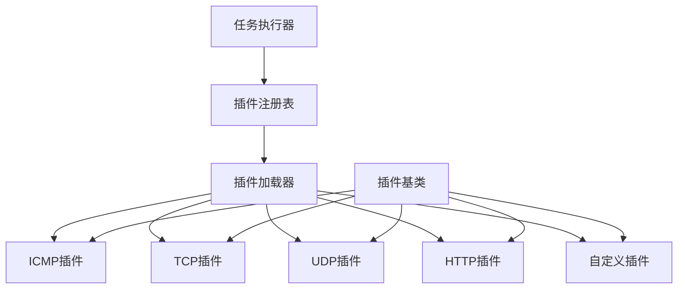

# 插件开发指南

## 概述

网络拨测平台支持通过插件系统扩展协议支持。插件系统允许开发者添加新的网络协议测试功能，而无需修改核心代码。本文档详细介绍如何开发、测试和部署协议插件。

## 插件架构

### 插件系统设计



### 核心组件

1. **插件基类**：定义插件接口和通用功能
2. **插件注册表**：管理已注册的插件
3. **插件加载器**：动态加载和初始化插件
4. **任务执行器**：调用插件执行拨测任务

## 插件接口定义

### 基础插件类

```python
# agent/protocols/base.py
from abc import ABC, abstractmethod
from typing import Dict, Any, Optional, List
from dataclasses import dataclass
from datetime import datetime
import asyncio

@dataclass
class ProbeResult:
    """拨测结果数据类"""
    status: str  # 'success', 'timeout', 'error'
    duration: float  # 执行时间（毫秒）
    timestamp: datetime
    metrics: Dict[str, Any]  # 协议特定指标
    error_message: Optional[str] = None
    raw_data: Optional[Dict[str, Any]] = None

@dataclass
class PluginInfo:
    """插件信息"""
    name: str
    version: str
    description: str
    author: str
    supported_parameters: List[str]
    default_timeout: int = 30

class ProtocolPlugin(ABC):
    """协议插件基类"""
    
    def __init__(self):
        self.info = self.get_plugin_info()
    
    @abstractmethod
    def get_plugin_info(self) -> PluginInfo:
        """返回插件信息"""
        pass
    
    @abstractmethod
    async def execute(self, target: str, parameters: Dict[str, Any]) -> ProbeResult:
        """执行拨测任务
        
        Args:
            target: 目标地址
            parameters: 协议特定参数
            
        Returns:
            拨测结果
        """
        pass
    
    @abstractmethod
    def validate_parameters(self, parameters: Dict[str, Any]) -> bool:
        """验证参数有效性
        
        Args:
            parameters: 要验证的参数
            
        Returns:
            参数是否有效
        """
        pass
    
    def get_default_parameters(self) -> Dict[str, Any]:
        """获取默认参数"""
        return {}
    
    async def cleanup(self):
        """清理资源"""
        pass
```

### 插件注册表

```python
# agent/protocols/registry.py
from typing import Dict, Type, List
from .base import ProtocolPlugin, PluginInfo
import importlib
import pkgutil
import logging

logger = logging.getLogger(__name__)

class PluginRegistry:
    """插件注册表"""
    
    def __init__(self):
        self._plugins: Dict[str, Type[ProtocolPlugin]] = {}
        self._instances: Dict[str, ProtocolPlugin] = {}
    
    def register(self, protocol: str, plugin_class: Type[ProtocolPlugin]):
        """注册插件
        
        Args:
            protocol: 协议名称
            plugin_class: 插件类
        """
        if not issubclass(plugin_class, ProtocolPlugin):
            raise ValueError(f"Plugin {plugin_class} must inherit from ProtocolPlugin")
        
        self._plugins[protocol] = plugin_class
        logger.info(f"Registered plugin for protocol: {protocol}")
    
    def get_plugin(self, protocol: str) -> ProtocolPlugin:
        """获取插件实例
        
        Args:
            protocol: 协议名称
            
        Returns:
            插件实例
        """
        if protocol not in self._instances:
            if protocol not in self._plugins:
                raise ValueError(f"Unknown protocol: {protocol}")
            
            self._instances[protocol] = self._plugins[protocol]()
        
        return self._instances[protocol]
    
    def list_protocols(self) -> List[str]:
        """列出支持的协议"""
        return list(self._plugins.keys())
    
    def get_plugin_info(self, protocol: str) -> PluginInfo:
        """获取插件信息"""
        plugin = self.get_plugin(protocol)
        return plugin.info
    
    def auto_discover(self, package_name: str = "agent.protocols"):
        """自动发现并注册插件"""
        try:
            package = importlib.import_module(package_name)
            for _, module_name, _ in pkgutil.iter_modules(package.__path__):
                if module_name == 'base' or module_name == 'registry':
                    continue
                
                try:
                    module = importlib.import_module(f"{package_name}.{module_name}")
                    self._discover_plugins_in_module(module)
                except Exception as e:
                    logger.error(f"Failed to load plugin module {module_name}: {e}")
        except Exception as e:
            logger.error(f"Failed to discover plugins: {e}")
    
    def _discover_plugins_in_module(self, module):
        """在模块中发现插件"""
        for attr_name in dir(module):
            attr = getattr(module, attr_name)
            if (isinstance(attr, type) and 
                issubclass(attr, ProtocolPlugin) and 
                attr != ProtocolPlugin):
                
                # 获取协议名称（通常是模块名）
                protocol = module.__name__.split('.')[-1]
                self.register(protocol, attr)

# 全局插件注册表实例
plugin_registry = PluginRegistry()
```

## 开发插件示例

### 1. DNS协议插件

```python
# agent/protocols/dns.py
import asyncio
import time
from typing import Dict, Any
import dns.resolver
import dns.exception
from .base import ProtocolPlugin, ProbeResult, PluginInfo

class DNSPlugin(ProtocolPlugin):
    """DNS协议插件"""
    
    def get_plugin_info(self) -> PluginInfo:
        return PluginInfo(
            name="DNS",
            version="1.0.0",
            description="DNS resolution testing plugin",
            author="Network Probe Team",
            supported_parameters=[
                "record_type", "nameserver", "timeout", "retry_count"
            ],
            default_timeout=10
        )
    
    def validate_parameters(self, parameters: Dict[str, Any]) -> bool:
        """验证DNS参数"""
        valid_record_types = ['A', 'AAAA', 'CNAME', 'MX', 'NS', 'TXT', 'SOA']
        
        record_type = parameters.get('record_type', 'A')
        if record_type not in valid_record_types:
            return False
        
        timeout = parameters.get('timeout', 10)
        if not isinstance(timeout, (int, float)) or timeout <= 0:
            return False
        
        retry_count = parameters.get('retry_count', 3)
        if not isinstance(retry_count, int) or retry_count < 0:
            return False
        
        return True
    
    def get_default_parameters(self) -> Dict[str, Any]:
        return {
            'record_type': 'A',
            'timeout': 10,
            'retry_count': 3,
            'nameserver': None
        }
    
    async def execute(self, target: str, parameters: Dict[str, Any]) -> ProbeResult:
        """执行DNS查询"""
        start_time = time.time()
        
        try:
            # 合并默认参数
            params = {**self.get_default_parameters(), **parameters}
            
            # 创建解析器
            resolver = dns.resolver.Resolver()
            resolver.timeout = params['timeout']
            resolver.lifetime = params['timeout']
            
            if params['nameserver']:
                resolver.nameservers = [params['nameserver']]
            
            # 执行DNS查询
            answers = await asyncio.get_event_loop().run_in_executor(
                None, 
                lambda: resolver.resolve(target, params['record_type'])
            )
            
            duration = (time.time() - start_time) * 1000
            
            # 处理查询结果
            records = []
            for answer in answers:
                records.append(str(answer))
            
            return ProbeResult(
                status='success',
                duration=duration,
                timestamp=datetime.utcnow(),
                metrics={
                    'record_count': len(records),
                    'record_type': params['record_type'],
                    'nameserver': resolver.nameservers[0] if resolver.nameservers else 'system',
                    'ttl': answers.rrset.ttl if answers.rrset else None
                },
                raw_data={
                    'records': records,
                    'canonical_name': str(answers.canonical_name) if answers.canonical_name else None
                }
            )
            
        except dns.resolver.NXDOMAIN:
            duration = (time.time() - start_time) * 1000
            return ProbeResult(
                status='error',
                duration=duration,
                timestamp=datetime.utcnow(),
                metrics={'error_type': 'NXDOMAIN'},
                error_message=f"Domain {target} does not exist"
            )
            
        except dns.resolver.Timeout:
            duration = (time.time() - start_time) * 1000
            return ProbeResult(
                status='timeout',
                duration=duration,
                timestamp=datetime.utcnow(),
                metrics={'error_type': 'TIMEOUT'},
                error_message=f"DNS query timeout for {target}"
            )
            
        except Exception as e:
            duration = (time.time() - start_time) * 1000
            return ProbeResult(
                status='error',
                duration=duration,
                timestamp=datetime.utcnow(),
                metrics={'error_type': 'UNKNOWN'},
                error_message=str(e)
            )
```

### 2. SMTP协议插件

```python
# agent/protocols/smtp.py
import asyncio
import time
import smtplib
import socket
from typing import Dict, Any
from .base import ProtocolPlugin, ProbeResult, PluginInfo

class SMTPPlugin(ProtocolPlugin):
    """SMTP协议插件"""
    
    def get_plugin_info(self) -> PluginInfo:
        return PluginInfo(
            name="SMTP",
            version="1.0.0",
            description="SMTP server testing plugin",
            author="Network Probe Team",
            supported_parameters=[
                "port", "use_tls", "use_ssl", "timeout", "username", "password"
            ],
            default_timeout=30
        )
    
    def validate_parameters(self, parameters: Dict[str, Any]) -> bool:
        """验证SMTP参数"""
        port = parameters.get('port', 25)
        if not isinstance(port, int) or port <= 0 or port > 65535:
            return False
        
        timeout = parameters.get('timeout', 30)
        if not isinstance(timeout, (int, float)) or timeout <= 0:
            return False
        
        return True
    
    def get_default_parameters(self) -> Dict[str, Any]:
        return {
            'port': 25,
            'use_tls': False,
            'use_ssl': False,
            'timeout': 30,
            'username': None,
            'password': None
        }
    
    async def execute(self, target: str, parameters: Dict[str, Any]) -> ProbeResult:
        """执行SMTP连接测试"""
        start_time = time.time()
        
        try:
            params = {**self.get_default_parameters(), **parameters}
            
            # 在线程池中执行SMTP连接
            result = await asyncio.get_event_loop().run_in_executor(
                None, 
                self._test_smtp_connection, 
                target, 
                params
            )
            
            return result
            
        except Exception as e:
            duration = (time.time() - start_time) * 1000
            return ProbeResult(
                status='error',
                duration=duration,
                timestamp=datetime.utcnow(),
                metrics={'error_type': 'UNKNOWN'},
                error_message=str(e)
            )
    
    def _test_smtp_connection(self, target: str, params: Dict[str, Any]) -> ProbeResult:
        """测试SMTP连接（同步方法）"""
        start_time = time.time()
        
        try:
            # 选择SMTP类
            if params['use_ssl']:
                smtp_class = smtplib.SMTP_SSL
            else:
                smtp_class = smtplib.SMTP
            
            # 建立连接
            with smtp_class(target, params['port'], timeout=params['timeout']) as server:
                connect_time = time.time()
                
                # 如果不是SSL，尝试STARTTLS
                if not params['use_ssl'] and params['use_tls']:
                    server.starttls()
                
                tls_time = time.time()
                
                # 如果提供了认证信息，尝试登录
                auth_success = True
                if params['username'] and params['password']:
                    try:
                        server.login(params['username'], params['password'])
                    except smtplib.SMTPAuthenticationError:
                        auth_success = False
                
                auth_time = time.time()
                
                # 获取服务器信息
                server_info = server.ehlo_resp or server.helo_resp
                
                duration = (auth_time - start_time) * 1000
                
                return ProbeResult(
                    status='success',
                    duration=duration,
                    timestamp=datetime.utcnow(),
                    metrics={
                        'connect_time': (connect_time - start_time) * 1000,
                        'tls_time': (tls_time - connect_time) * 1000 if params['use_tls'] else 0,
                        'auth_time': (auth_time - tls_time) * 1000 if params['username'] else 0,
                        'auth_success': auth_success,
                        'supports_tls': server.has_extn('STARTTLS'),
                        'supports_auth': server.has_extn('AUTH')
                    },
                    raw_data={
                        'server_response': server_info.decode() if server_info else None,
                        'extensions': list(server.esmtp_features.keys()) if hasattr(server, 'esmtp_features') else []
                    }
                )
                
        except socket.timeout:
            duration = (time.time() - start_time) * 1000
            return ProbeResult(
                status='timeout',
                duration=duration,
                timestamp=datetime.utcnow(),
                metrics={'error_type': 'TIMEOUT'},
                error_message=f"Connection to {target}:{params['port']} timed out"
            )
            
        except ConnectionRefusedError:
            duration = (time.time() - start_time) * 1000
            return ProbeResult(
                status='error',
                duration=duration,
                timestamp=datetime.utcnow(),
                metrics={'error_type': 'CONNECTION_REFUSED'},
                error_message=f"Connection to {target}:{params['port']} refused"
            )
            
        except Exception as e:
            duration = (time.time() - start_time) * 1000
            return ProbeResult(
                status='error',
                duration=duration,
                timestamp=datetime.utcnow(),
                metrics={'error_type': 'SMTP_ERROR'},
                error_message=str(e)
            )
```

## 插件测试

### 单元测试

```python
# tests/unit/test_dns_plugin.py
import pytest
import asyncio
from unittest.mock import patch, MagicMock
from agent.protocols.dns import DNSPlugin
from agent.protocols.base import ProbeResult

class TestDNSPlugin:
    def setup_method(self):
        self.plugin = DNSPlugin()
    
    def test_plugin_info(self):
        """测试插件信息"""
        info = self.plugin.get_plugin_info()
        assert info.name == "DNS"
        assert info.version == "1.0.0"
        assert "record_type" in info.supported_parameters
    
    def test_validate_parameters_valid(self):
        """测试有效参数验证"""
        params = {
            'record_type': 'A',
            'timeout': 10,
            'retry_count': 3
        }
        assert self.plugin.validate_parameters(params) is True
    
    def test_validate_parameters_invalid_record_type(self):
        """测试无效记录类型"""
        params = {'record_type': 'INVALID'}
        assert self.plugin.validate_parameters(params) is False
    
    def test_validate_parameters_invalid_timeout(self):
        """测试无效超时时间"""
        params = {'timeout': -1}
        assert self.plugin.validate_parameters(params) is False
    
    @pytest.mark.asyncio
    async def test_execute_success(self):
        """测试成功执行"""
        with patch('dns.resolver.Resolver') as mock_resolver_class:
            # 模拟DNS解析结果
            mock_resolver = MagicMock()
            mock_resolver_class.return_value = mock_resolver
            
            mock_answer = MagicMock()
            mock_answer.__str__ = lambda: "192.168.1.1"
            mock_answers = [mock_answer]
            mock_answers.rrset = MagicMock()
            mock_answers.rrset.ttl = 300
            mock_answers.canonical_name = "example.com"
            
            mock_resolver.resolve.return_value = mock_answers
            
            result = await self.plugin.execute("example.com", {})
            
            assert result.status == 'success'
            assert result.duration > 0
            assert result.metrics['record_count'] == 1
            assert result.metrics['record_type'] == 'A'
    
    @pytest.mark.asyncio
    async def test_execute_timeout(self):
        """测试超时情况"""
        with patch('dns.resolver.Resolver') as mock_resolver_class:
            mock_resolver = MagicMock()
            mock_resolver_class.return_value = mock_resolver
            mock_resolver.resolve.side_effect = dns.resolver.Timeout()
            
            result = await self.plugin.execute("example.com", {})
            
            assert result.status == 'timeout'
            assert 'TIMEOUT' in result.error_message
```

### 集成测试

```python
# tests/integration/test_plugin_integration.py
import pytest
import asyncio
from agent.protocols.registry import PluginRegistry
from agent.protocols.dns import DNSPlugin

class TestPluginIntegration:
    def setup_method(self):
        self.registry = PluginRegistry()
        self.registry.register('dns', DNSPlugin)
    
    def test_plugin_registration(self):
        """测试插件注册"""
        assert 'dns' in self.registry.list_protocols()
        plugin = self.registry.get_plugin('dns')
        assert isinstance(plugin, DNSPlugin)
    
    @pytest.mark.asyncio
    async def test_real_dns_query(self):
        """测试真实DNS查询"""
        plugin = self.registry.get_plugin('dns')
        result = await plugin.execute("google.com", {'record_type': 'A'})
        
        assert result.status == 'success'
        assert result.duration > 0
        assert result.metrics['record_count'] > 0
    
    def test_plugin_info_retrieval(self):
        """测试插件信息获取"""
        info = self.registry.get_plugin_info('dns')
        assert info.name == "DNS"
        assert len(info.supported_parameters) > 0
```

## 插件部署

### 1. 打包插件

创建插件包结构：

```
my_custom_plugin/
├── setup.py
├── README.md
├── requirements.txt
└── my_plugin/
    ├── __init__.py
    └── protocol.py
```

`setup.py` 示例：

```python
from setuptools import setup, find_packages

setup(
    name="network-probe-custom-plugin",
    version="1.0.0",
    description="Custom protocol plugin for Network Probe Platform",
    author="Your Name",
    author_email="your.email@example.com",
    packages=find_packages(),
    install_requires=[
        "network-probe-platform>=1.0.0",
        # 其他依赖
    ],
    entry_points={
        'network_probe.plugins': [
            'custom_protocol = my_plugin.protocol:CustomProtocolPlugin',
        ],
    },
    classifiers=[
        "Development Status :: 4 - Beta",
        "Intended Audience :: Developers",
        "License :: OSI Approved :: MIT License",
        "Programming Language :: Python :: 3.11",
    ],
)
```

### 2. 安装插件

```bash
# 从源码安装
pip install -e /path/to/my_custom_plugin

# 从PyPI安装
pip install network-probe-custom-plugin

# 从Git仓库安装
pip install git+https://github.com/user/network-probe-custom-plugin.git
```

### 3. 配置插件

在代理配置文件中启用插件：

```yaml
# agent/config/config.yaml
plugins:
  enabled: true
  auto_discover: true
  custom_plugins:
    - name: "custom_protocol"
      module: "my_plugin.protocol"
      class: "CustomProtocolPlugin"
      enabled: true
```

### 4. 验证插件

```bash
# 列出可用协议
python -m agent.protocols.registry list

# 测试插件
python -m agent.protocols.registry test custom_protocol example.com
```

## 最佳实践

### 1. 错误处理

```python
async def execute(self, target: str, parameters: Dict[str, Any]) -> ProbeResult:
    start_time = time.time()
    
    try:
        # 执行拨测逻辑
        result = await self._perform_test(target, parameters)
        return result
        
    except asyncio.TimeoutError:
        return self._create_timeout_result(start_time)
    except ConnectionError as e:
        return self._create_connection_error_result(start_time, e)
    except Exception as e:
        return self._create_generic_error_result(start_time, e)

def _create_timeout_result(self, start_time: float) -> ProbeResult:
    """创建超时结果"""
    return ProbeResult(
        status='timeout',
        duration=(time.time() - start_time) * 1000,
        timestamp=datetime.utcnow(),
        metrics={'error_type': 'TIMEOUT'},
        error_message="Operation timed out"
    )
```

### 2. 参数验证

```python
def validate_parameters(self, parameters: Dict[str, Any]) -> bool:
    """全面的参数验证"""
    try:
        # 检查必需参数
        required_params = ['param1', 'param2']
        for param in required_params:
            if param not in parameters:
                return False
        
        # 检查参数类型和范围
        if not isinstance(parameters.get('timeout'), (int, float)):
            return False
        
        if parameters['timeout'] <= 0 or parameters['timeout'] > 300:
            return False
        
        # 检查枚举值
        valid_modes = ['mode1', 'mode2', 'mode3']
        if parameters.get('mode') not in valid_modes:
            return False
        
        return True
        
    except Exception:
        return False
```

### 3. 资源管理

```python
class MyProtocolPlugin(ProtocolPlugin):
    def __init__(self):
        super().__init__()
        self._connection_pool = None
        self._session = None
    
    async def _ensure_session(self):
        """确保会话已初始化"""
        if self._session is None:
            self._session = aiohttp.ClientSession()
    
    async def execute(self, target: str, parameters: Dict[str, Any]) -> ProbeResult:
        await self._ensure_session()
        # 使用会话执行请求
        pass
    
    async def cleanup(self):
        """清理资源"""
        if self._session:
            await self._session.close()
            self._session = None
```

### 4. 日志记录

```python
import logging

logger = logging.getLogger(__name__)

class MyProtocolPlugin(ProtocolPlugin):
    async def execute(self, target: str, parameters: Dict[str, Any]) -> ProbeResult:
        logger.info(f"Starting {self.info.name} test for {target}")
        
        try:
            result = await self._perform_test(target, parameters)
            logger.info(f"Test completed successfully: {result.status}")
            return result
            
        except Exception as e:
            logger.error(f"Test failed: {e}", exc_info=True)
            raise
```

### 5. 性能优化

```python
import asyncio
from functools import lru_cache

class MyProtocolPlugin(ProtocolPlugin):
    @lru_cache(maxsize=128)
    def _get_cached_config(self, key: str):
        """缓存配置信息"""
        return self._load_config(key)
    
    async def execute(self, target: str, parameters: Dict[str, Any]) -> ProbeResult:
        # 使用连接池
        async with self._connection_pool.acquire() as conn:
            # 执行测试
            pass
        
        # 批量处理
        tasks = []
        for i in range(parameters.get('parallel_count', 1)):
            task = asyncio.create_task(self._single_test(target, parameters))
            tasks.append(task)
        
        results = await asyncio.gather(*tasks, return_exceptions=True)
        return self._aggregate_results(results)
```

## 插件示例库

### 可用插件

1. **DNS插件**：DNS解析测试
2. **SMTP插件**：邮件服务器测试
3. **FTP插件**：FTP服务器测试
4. **SSH插件**：SSH连接测试
5. **MySQL插件**：MySQL数据库连接测试
6. **Redis插件**：Redis服务器测试

### 社区插件

访问我们的[插件市场](https://plugins.network-probe.com)查看更多社区贡献的插件。

## 故障排除

### 常见问题

1. **插件加载失败**
   - 检查插件是否正确安装
   - 验证插件类是否继承自ProtocolPlugin
   - 查看错误日志

2. **参数验证失败**
   - 检查参数类型和格式
   - 确认必需参数是否提供
   - 验证参数值范围

3. **执行超时**
   - 调整超时参数
   - 检查网络连接
   - 优化插件性能

### 调试技巧

```python
# 启用调试日志
import logging
logging.basicConfig(level=logging.DEBUG)

# 使用调试装饰器
def debug_plugin(func):
    async def wrapper(*args, **kwargs):
        logger.debug(f"Calling {func.__name__} with args: {args}, kwargs: {kwargs}")
        result = await func(*args, **kwargs)
        logger.debug(f"Result: {result}")
        return result
    return wrapper

class MyProtocolPlugin(ProtocolPlugin):
    @debug_plugin
    async def execute(self, target: str, parameters: Dict[str, Any]) -> ProbeResult:
        # 插件逻辑
        pass
```

## 贡献插件

如果您开发了有用的插件，欢迎贡献给社区：

1. 在GitHub上创建插件仓库
2. 编写完整的文档和测试
3. 提交到插件市场
4. 参与社区讨论和维护

更多信息请参考[贡献指南](contributing.md)。